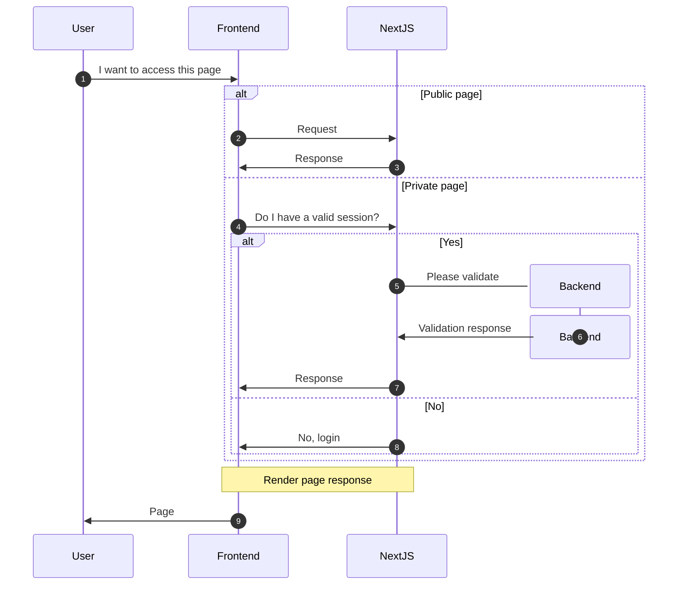

# What is the logic behind our influencers games?

The basic interaction of the users begin with the landing page or direct access to the game. Its logic is as follows:

```mermaid
sequenceDiagram
    autonumber
    participant User as User
    participant Front as Frontend
    participant Next as NextJS
    User->>Front: I want to access this page
    alt Public page
        Front->>Next: Request
        Next->>Front: Response
    else Private page
        Front->>Next: Do I have a valid session?
        alt Yes
            create participant Back as Backend
            Next->Back: Please validate
            destroy Back
            Back->>Next: Validation response
            Next->>Front: Response
        else No
            Next->>Front: No, login
        end
    end
    Note over Front, Next: Render page response
        Front->>User: Page
```
